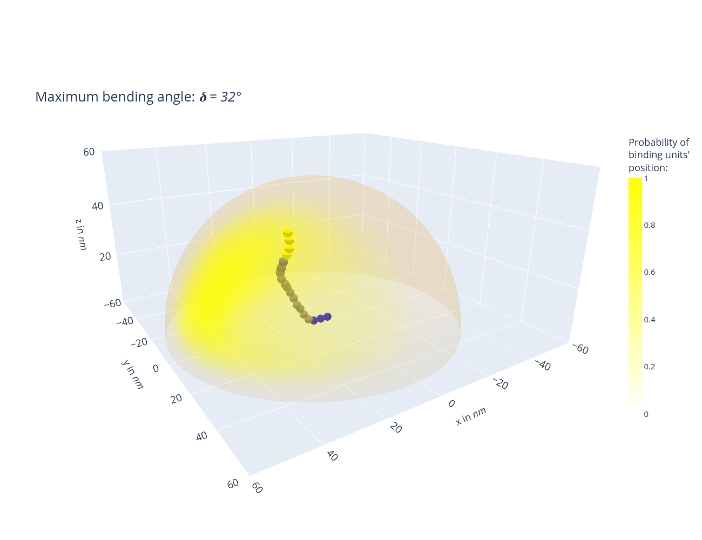

# FHR1, FHR1* and Factor H Computations

An advanced Monte Carlo simulation framework to estimate the distribution of binding units' positions for Factor H and FHR-1 through stochastic processes.

Author: Christoph Saffer

Research Group Applied Systems Biology - Head: Prof. Dr. Marc Thilo Figge\
https://www.leibniz-hki.de/en/applied-systems-biology.html \
HKI-Center for Systems Biology of Infection\
Leibniz Institute for Natural Product Research and Infection Biology - Hans Knöll Institute (HKI)\
Adolf-Reichwein-Straße 23, 07745 Jena, Germany

The project code is licensed under BSD 2-Clause.\
See the LICENSE file provided with the code for the full license.

## Project

This is a comprehensive framework designed to employ Monte Carlo simulations for determining the probabilistic positions of binding units for FHR1, FHR1* and Factor H. The methodology utilizes stochastic processes to generate multiple outcomes, thereby yielding an approximation of the distribution of these binding units' locations.

Through Monte Carlo simulations, we map N=1,000,000 configurations of FHR1, FHR1* and Factor H binding domains (units) onto a 3D grid, determining probable locations under various maximum bending angles. These angles, depicting the upper limit between two units, are uniformly sampled, offering unique structural insights into the spatial arrangement of binding units.
- Use the jupyter labbook 'factorh_computations.ipynb' or use the results located in 'datasets'
- The blue spheres are attached to the cell surface, the yellow spheres represent the binding units
- Generated plots and videos are located in 'images'

.

Figure: Probable locations of Factor H binding domains (units) with exemplary molecule
